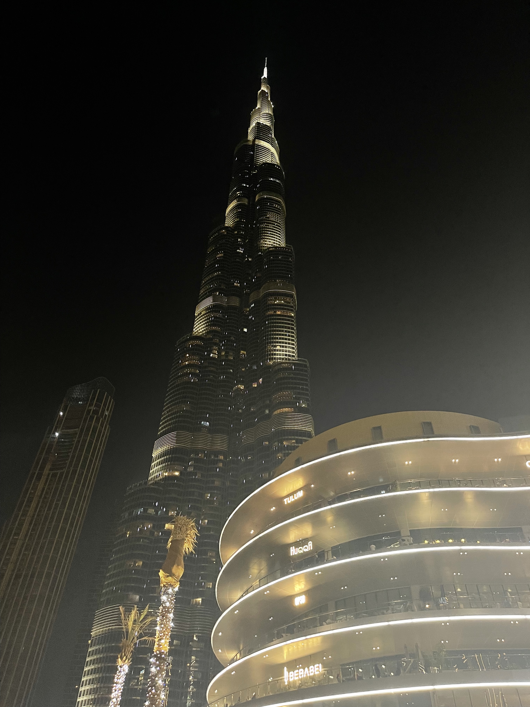

___
DISCLAIMER
I would like to avoid posting personal photos and info on web except my social networks. Thanks for undestanding.  
___

# Welcome to my sample page

#### Here I want to share one amazing pic shot in eary October, 2022.  

  

**Shot on iPhone**

Mr. Mohamed Alabbar, Chairman of Emaar Properties, said:  

> Burj Khalifa goes beyond its imposing physical specifications. In Burj Khalifa, we see the triumph of Dubai's vision of attaining the seemingly impossible and setting new benchmarks. It is a source of inspiration for every one of us at Emaar[^1]. The project is a declaration of the Emirate's capabilities and of the resolve of its leaders and people to work hand-in-hand on truly awe-inspiring projects. 

I have taken this picture on Oct, 3 2022 while being on my honeymoon.  
Not only this building fascinates when looking up at it from ground, but the view that opens from floor 140 is breathtaking as well. Just imagine: over <mark> 828 </mark> meters high! 
I was also excited to travel on fastest elevator in the world, the feeling might be compared with the one you experince when on a plane and it takes off.  

- [x] Kiss on last floor of world's highest building  
- [ ] Take pretty panoramic pictures 

*It was the best hundred bucks I spent on attending viewpoints.*

|Date|Original Format|Original size
|---|---|---|
|03.10.2022|.HEIC|2.1 Mb  

It's notable that [rumors say](https://www.netnewsledger.com/2022/11/14/will-the-jeddah-tower-ever-be-finished/) Saudi Arabia to build even higher skyskraper, the first-ever building over 1 km heigh. *However constructino is currently on-hold".  

[^1]: Emaar Properties is an Emirati multinational real estate development company located in the United Arab Emirates.

